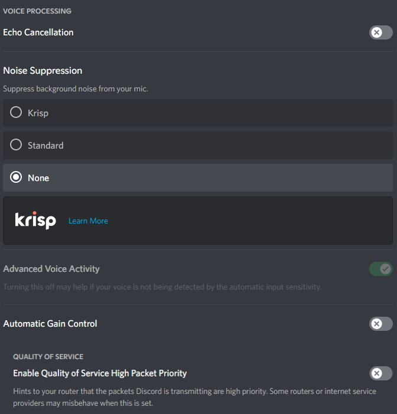

# edoStereo Plugin 0.0.2
###### [ENG] Requires a capable stereo microphone! 
###### [GER] Benötigt ein geeignetes Stereomikrofon!
## [ENGLISH]

## Stereo sound for Discord. BetterDiscord 1.8.4

### Installing Proccess

**Step 1.** Install BetterDiscord [Here](https://betterdiscord.app/)

 

**Step 2.** Download the plugin [Here](https://downgit.github.io/#/home?url=https://github.com/edoderg/edoStereo)

 

**Step 3.** Add the plugin to your BetterDiscord plugin folder.

 
 

## ⚠️NOTE⚠️ TURN THESE SETTINGS OFF⚠️

## [GERMAN]

## Stereo Sound für Discord. BetterDiscord 1.8.4

### Installieren

**Schritt 1.** Installier BetterDiscord [Hier](https://betterdiscord.app/)

 

**Schritt 2.** Lade das Plugin herunter [Hier](https://downgit.github.io/#/home?url=https://github.com/edoderg/edoStereo)

 

**Schritt 3.** Füge das Plugin in deinen BetterDiscord Plugin Ordner ein.

## ⚠️WARNUNG⚠️ STELLE DIESE EINSTELLUNGEN AUS⚠️

# LEAVE A ⭐ THANK YOU

## edo#0001 on discord

### Basic Code Structure inspired by @bepvte - @riolubruh <3
